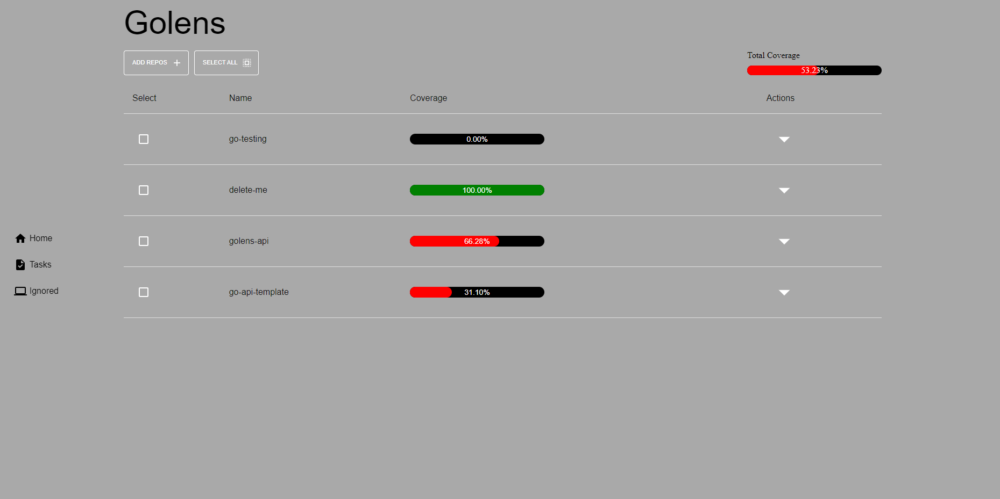

<p align="center">
  
  <h3 align="center">golens</h3>
  <p align="center">Code Coverage Visualization</p>
</p>

---

`golens` is a code coverage visualization tool for your Go projects. Originally built to get an understanding of code coverage across a large microservice architecture.



## Getting started

1. Install and run the golens backend.
   [golens-api](https://github.com/adavila0703/golens-api)

1. Install dependencies

```sh
npm install
```

3. Copy these to .env

```
VITE_HOST=http://localhost
VITE_PORT=3000

// make sure this auth token matches your backend
VITE_AUTHORIZATION=68daa0a7-b8c0-4735-9328-f8c876aeb0b9
```

4. Run the app

```
npm run dev
```
